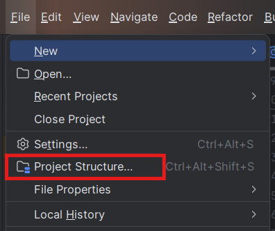
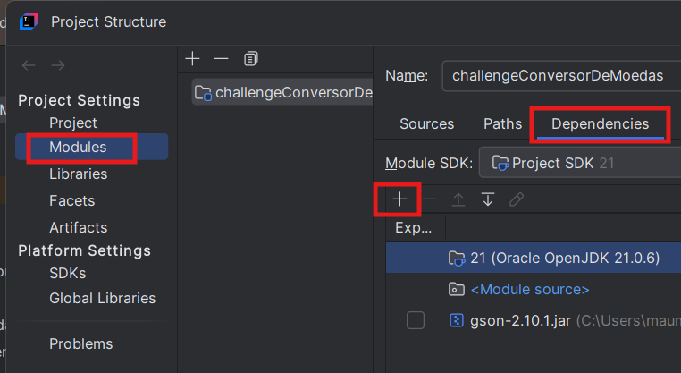

# Conversor de Moedas [](https://percy.io/b2e34b17/openmct) [](https://www.npmjs.com/package/openmct) 
O Challenge Conversor de Moedas, é um projeto final do curso de java - orientação a objetos. Ofereça interação textual (via console) com os usuários, proporcionando no mínimo 6 opções distintas de conversões de moedas em um menu. A taxa de conversão não será estática, mas sim dinamicamente obtida por meio de uma API, garantindo dados precisos em tempo real para uma experiência mais atualizada e eficaz.

- **objetivo**

> Via console, o usuário vai entrar com a opção que deseja dentro desse menu, e depois disso vai informar qual é o valor que deseja converter.

- **o que encontrar**

> o usuário terá 06(seis) opçoes de escolha para a conversão de moedas.

- **customizável**

> o usuário vai poder realizar a conversão quantas vezes for necessário enquanto o programa estiver em execução, evitando encerrar para obter uma nova consulta.

## Compilando e Executando o Conversor de Moedas
Certifique-se de ter o [intelliJ](https://www.jetbrains.com/idea/download/?section=windows) e a biblioteca [GSON](https://mvnrepository.com/search?q=GSON) instalados e baixado, e siga as instruções conforme abaixo:
1. Faça download do código fonte:

```sh
https://github.com/maumauriciog/challenge_conversor_de_moedas
```

2. Instale a biblioteca GSON, após download (Instale após abrir o código fonte no intelliJ - o programa precisa desta biblioteca instalada para garantir seu funcionamento):

&emsp;&emsp;&emsp;&emsp;

```
- vá ao menu File do intelliJ e escolha a opção 'Project Structure'
- click e 'Modules'
- click em 'Dependencies' no lado direito
- click no sinal de '+'
- click na opção 'JARs or Directories'
- selecione a biblioteca GSON baixada anteriormente
```

3. Execute o programa:
&emsp;&emsp;

```
- click em 'Run Main'
- ou Shift F10
```

> [!IMPORTANT]
> O programa funciona somente local utilizando uma IDE, neste caso, o [intelliJ](https://www.jetbrains.com/idea/download/?section=windows) com a biblioteca GSON instalada.

## Utilizando o Programa em Execução
O usuário terá de escolha uma das 06(seis) opções conforme mostra abaixo:
```bash
-----------------------------------------------
---- SEJA BEM VINDO AO CONVERSOR DE MOEDAS ----
-----------------------------------------------
1). Dolar -> Peso Argentino
2). Peso Argentino -> Dolar
3). Dolar -> Real Brasileiro
4). Real Brasileiro -> Dolar
5). Dolar -> Peso Colombiano
6). Peso Colombiano -> Dolar
7). Sair

-> Escolha uma opção válida: _
-> Digite o valor que deseja converter: _
```
```bash
     *** Resultado da Operação ***
     Valor de 100.0[BRL], corresponde ao valor final de 17.52[USD]
```

## Contribuindo
Esperamos que outras organizações possam se beneficiar do projeto. Agradecemos qualquer contribuição da comunidade.

## Contato
Temos os seguintes canais para contato:

- maumauriciog@hotmail.com
  - `no campo Assunto escreva: Ajuda` para assuntos de como utilizar o sistema; e
  - `no campo Assunto escreva: Quero Contribuir` para aqueles que desejam contribuir.
- [GitHub](https://github.com/maumauriciog)


## Licensa
Docusaurus is [MIT licensed](./LICENSE).
```
The MIT License (MIT)

Copyright (c) 2025 Maurício Gomes das Chagas

Permission is hereby granted, free of charge, to any person obtaining a copy of
this software and associated documentation files (the "Software"), to deal in
the Software without restriction, including without limitation the rights to
use, copy, modify, merge, publish, distribute, sublicense, and/or sell copies of
the Software, and to permit persons to whom the Software is furnished to do so,
subject to the following conditions:

The above copyright notice and this permission notice shall be included in all
copies or substantial portions of the Software.

THE SOFTWARE IS PROVIDED "AS IS", WITHOUT WARRANTY OF ANY KIND, EXPRESS OR
IMPLIED, INCLUDING BUT NOT LIMITED TO THE WARRANTIES OF MERCHANTABILITY, FITNESS
FOR A PARTICULAR PURPOSE AND NONINFRINGEMENT. IN NO EVENT SHALL THE AUTHORS OR
COPYRIGHT HOLDERS BE LIABLE FOR ANY CLAIM, DAMAGES OR OTHER LIABILITY, WHETHER
IN AN ACTION OF CONTRACT, TORT OR OTHERWISE, ARISING FROM, OUT OF OR IN
CONNECTION WITH THE SOFTWARE OR THE USE OR OTHER DEALINGS IN THE SOFTWARE.
```

## Agradecimento Especiais
<p>
  <a href="http://www.browserstack.com/" target="_blank">
    <picture>
      <source media="(prefers-color-scheme: dark)" srcset="./admin/img/browserstack-dark-mode-logo.svg#gh-dark-mode-only">
      
    </picture>
  </a>
</p>

[BrowserStack](http://www.browserstack.com/) supports us with [free access for open source](https://www.browserstack.com/open-source).

[](https://rocketvalidator.com/)

[Rocket Validator](https://rocketvalidator.com/) helps us find HTML markup or accessibility issues.
